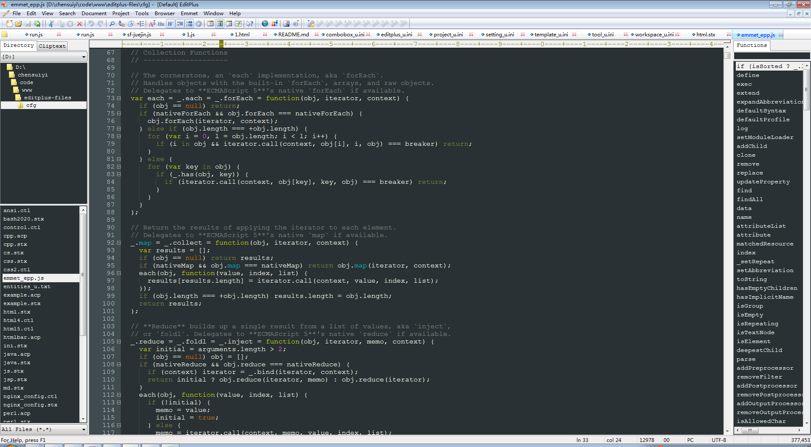
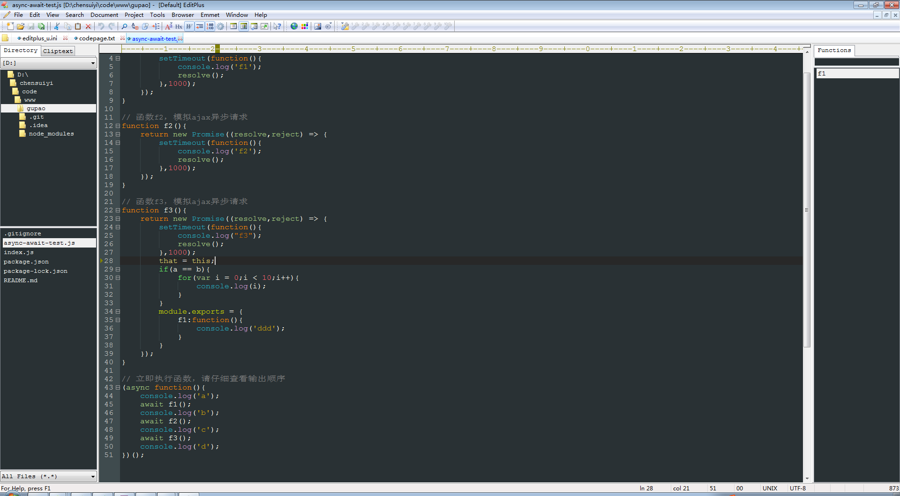

## EditPlus-Files

EditPlus编辑器的配置参数和语法文件

|作者|网站|扣扣|微信|
|---|---|---|---|
|陈随易|[个人网站](http://chensuiyi.com)|24323626|C91374286|

## 配置配置文件

`ini` 目录

## 语法/自动补全/代码片段文件目录

`cfg` 目录

## 插件存放目录

`plg` 目录

## 编辑器界面展示

